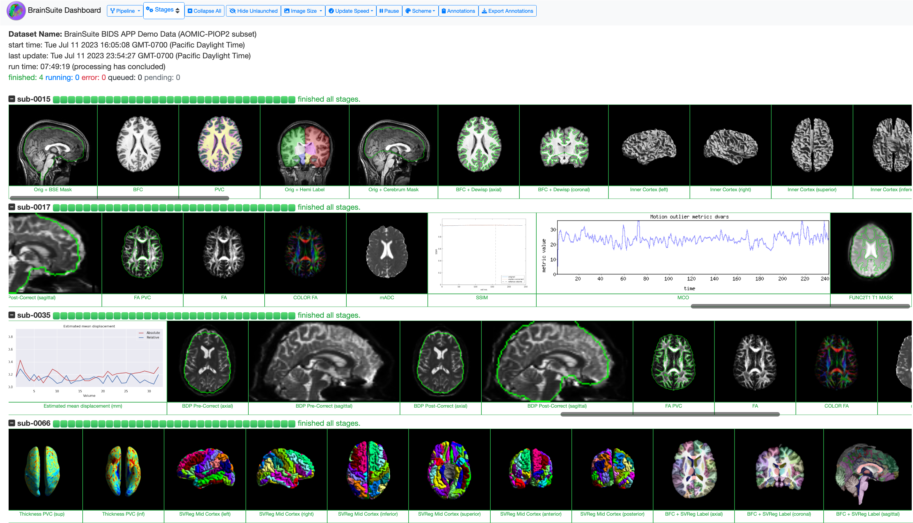

# BrainSuite BIDS App 
This readme provides an outline of the functionality of the BrainSuite BIDS App.
For more detailed instructions on installation and use, please visit [our BrainSuite BIDS App documentation page](https://brainsuite.org/BIDS/).
We have made a small set of [sample data available](https://github.com/BrainSuite/BrainSuiteBIDSAppSampleData).
A demo of the BrainSuite Dashboard interface, showing the processing of the sample data, is available [on our Github site](https://brainsuite.github.io/DashboardDemo/).	

## Overview
The BrainSuite BIDS App provides a portable, streamlined method for applying [BrainSuite](https://brainsuite.org) workflows to process and analyze anatomical, diffusion, and functional MRI data. This release of the BrainSuite BIDS-App is based on [version 23a of BrainSuite](https://brainsuite.org/brainsuite23a).
The BrainSuite BIDS-App implements three major BrainSuite pipelines for subject-level analysis, as well as corresponding group-level analysis functionality.

### Participant-level processing

<p align="center">
 
</p>

BrainSuite BIDS App's participant-level processing comprises three core pipelines:

* `The BrainSuite Anatomical Pipeline (BAP)` processes T1-weighted (T1w) data by extracting cortical surface models ([CSE](https://brainsuite.org/processing/surfaceextraction/)) from a T1w MRI, computing cortical thickness, and performing surface-constrained volumetric registration ([SVReg](https://brainsuite.org/processing/svreg/)) to align the T1w MRI to a labeled anatomical atlas.
* `The BrainSuite Diffusion Pipeline (BDP)` processes diffusion MRI (dMRI) data by correcting for eddy current and motion artifacts using [FSL's eddy](https://fsl.fmrib.ox.ac.uk/fsl/fslwiki/eddy), co-registering the dMRI to the T1w data, correcting for geometric image distortion, and fitting diffusion models ([BDP](https://brainsuite.org/processing/diffusion/)).
* `The BrainSuite Functional Pipeline (BFP)` processes functional MRI (fMRI) data by coregistering the fMRI data to the T1w data, correcting for motion, detecting outliers, and then transforming the data to the anatomical atlas space and to the grayordinate space using tools from [BrainSuite](https://brainsuite.org/bfp/), [FSL](fsl.fmrib.ox.ac.uk), and [AFNI](afni.nimh.nih.gov). 

### Group-level analysis

<p align="center">
 
</p>

* BrainSuite BIDS App's group-level analysis of structural data uses the BrainSuite Statistics Toolbox in R ([bstr](https://brainsuite.org/bssr/)), which supports:

    * Tensor based morphometry (TBM) analysis.
    * Cortical surface analysis of the vertex-wise thickness.
    * Diffusion parameter maps analysis (e.g., FA, MD).
    * ROI-based analysis of average measurements (e.g., gray matter thickness, surface area).
  
  Additionally, bstr offers:

    * Pearson correlation, general linear model, ANOVA, t-test, and permutation tests.
    * Automated report generation to visualize statistical results.


* BrainSuite BIDS App's group-level analysis of fMRI data (functional connectivity) is performed using [BrainSync](https://github.com/ajoshiusc/bfp/tree/master/src/BrainSync), which synchronizes time-series data temporally. Available analyses include:

    * Atlas-based method: linear modeling using a reference dataset created from multiple input datasets.
    * Atlas-free method: pairwise testing of all pairs of subjects, which is then used as test statistics for regression or group difference studies.

### BrainSuite Dashboard and QC system

<p align="center">
 
</p>

The BrainSuite Dashboard is a browser-based system that provides interactive visualization of the intermediate participant-level workflow outputs as they are generated. This enables users to monitor the state of processing and identify errors as they occur. A quality control (QC) component in the BrainSuite BIDS App generates snapshots of key stages in the participant-level workflows, which are loaded in real time by the BrainSuite Dashboard for quick visualization and assessment.


### Command line arguments
```bash
usage: run.py [-h]
              [--stages {CSE,SVREG,BDP,BFP,DASHBOARD,ALL} [{CSE,SVREG,BDP,BFP,DASHBOARD,ALL} ...]]
              [--preprocspec PREPROCSPEC]
              [--participant_label PARTICIPANT_LABEL [PARTICIPANT_LABEL ...]]
              [--session SESSION [SESSION ...]] [--skipBSE]
              [--atlas {BSA,BCI-DNI,USCBrain}] [--singleThread] [--TR TR]
              [--fmri_task_name FMRI_TASK_NAME [FMRI_TASK_NAME ...]]
              [--ignore_suffix IGNORE_SUFFIX] [--QCdir QCDIR]
              [--QCsubjList QCSUBJLIST] [--localWebserver] [--port PORT]
              [--bindLocalHostOnly] [--modelspec MODELSPEC]
              [--analysistype {STRUCT,FUNC,ALL}] [--rmarkdown RMARKDOWN]
              [--ignoreSubjectConsistency] [--bidsconfig [BIDSCONFIG]]
              [--cache CACHE] [--ncpus NCPUS] [--maxmem MAXMEM] [-v]
              bids_dir output_dir {participant,group}

BrainSuite23a BIDS-App (T1w, dMRI, rs-fMRI). Copyright (C) 2022 The Regents of
the University of California Dept. of Neurology, David Geffen School of
Medicine, UCLA.

positional arguments:
  bids_dir              The directory with the input dataset formatted
                        according to the BIDS standard.
  output_dir            The directory where the output files should be stored.
                        If you are running group level analysis this folder
                        should be prepopulated with the results of
                        theparticipant level analysis.
  {participant,group}   Level of the analysis that will be performed. Multiple
                        participant level analyses can be run independently
                        (in parallel) using the same output_dir. The group
                        analysis performs group statistical analysis.

optional arguments:
  -h, --help            show this help message and exit
  --stages {CSE,SVREG,BDP,BFP,DASHBOARD,ALL} [{CSE,SVREG,BDP,BFP,DASHBOARD,ALL} ...]
                        Participant-level processing stage to be run. Space
                        delimited list. Default is ALL which does not include
                        DASHBOARD. CSE runs Cortical Surface Extractor and
                        cortical thickness computation, which are the initial
                        portions of the BrainSuite Anatomical Pipeline (BAP).
                        SVREG runs Surface-constrained Volumetric
                        registration, which is the latter portion of BAP. BDP
                        runs BrainSuite Diffusion Pipeline. BFP runs
                        BrainSuite Functional Pipeline. DASHBOARD runs the
                        real-time monitoring that is required for BrainSuite
                        Dashboard to update real-time. However, DASHBOARD can
                        still be run after the participant-level processing
                        has ended to generate the browser-based BrainSuite
                        Dashboard.
  --preprocspec PREPROCSPEC
                        Optional. BrainSuite preprocessing parameters.Path to
                        JSON file that contains preprocessing specifications.
  --cache CACHE         Nipype cache output folder.
  --ncpus NCPUS         Number of cpus allocated for running subject-level
                        processing.
  --maxmem MAXMEM       Maximum memory (in GB) that can be used at once.
  -v, --version         show program's version number and exit

Options for selectively running specific datasets:
  --participant_label PARTICIPANT_LABEL [PARTICIPANT_LABEL ...]
                        The label of the participant that should be analyzed.
                        The label corresponds to sub-<participant_label> from
                        the BIDS spec (so it does not include "sub-"). If this
                        parameter is not provided, all subjects will be
                        analyzed. Multiple participants can be specified with
                        a space separated list.
  --session SESSION [SESSION ...]
                        The session label of the participant that should be
                        analyzed. The label corresponds to ses-<session label>
                        from the BIDS spec (so it does not include "ses-"). If
                        this parameter is not provided, all sessions will be
                        analyzed. Multiple sessions can be specified with a
                        space separated list.

Command line arguments for BrainSuite Anatomical Pipeline (BAP). For more parameter options, please edit the preprocspecs.json file:
  --skipBSE             Skips BSE stage when running CSE. Please make sure
                        there are sub-ID_T1w.mask.nii.gz files in the subject
                        folders.
  --atlas {BSA,BCI-DNI,USCBrain}
                        Atlas that is to be used for labeling in SVReg.
                        Default atlas: BCI-DNI. Options: BSA, BCI-DNI,
                        USCBrain.
  --singleThread        Turns on single-thread mode for SVReg.This option can
                        be useful when machines run into issues with the
                        parallel processing tool from Matlab (Parpool).

Command line arguments for BrainSuite Functional Pipeline (BFP). For more parameter options, please edit the preprocspecs.json file:
  --TR TR               Repetition time of MRI (in seconds).
  --fmri_task_name FMRI_TASK_NAME [FMRI_TASK_NAME ...]
                        fMRI task name to be processed during BFP. The name
                        should only containthe contents after "task-". E.g.,
                        restingstate.
  --ignore_suffix IGNORE_SUFFIX
                        Optional. Users can define which suffix to ignore in
                        the output folder. E.g., if input T1w is sub-01_ses-
                        A_acq-highres_run-01_T1w.nii.gz,and user would like to
                        ignore the "acq-highres" suffix portion, then user can
                        type "--ignore_suffix acq", which will render
                        sub-01_ses-A_run-01 output folders.

Options for BrainSuite QC and Dashboard:
  --QCdir QCDIR         Designate directory for QC Dashboard.
  --QCsubjList QCSUBJLIST
                        For QC purposes, optional subject list (txt format,
                        individual subject ID separated by new lines; subject
                        ID without "sub-" is required (i.e. 001). This is
                        helpfulin displaying only the thumbnails of the queued
                        subjects when running on clusters/compute nodes.
  --localWebserver      Launch local webserver for QC.
  --port PORT           Port number for QC local webserver. This defines the
                        port number inside the BrainSuite BIDS App container.
                        If using Singularity version of BrainSuite BIDS App,
                        this argument also defines the port number of the
                        local host.
  --bindLocalHostOnly   When running local web server through this app, the
                        server binds to all of the IPs on the machine. If you
                        would like to only bind to the local host, please use
                        this flag.

Arguments and options for group-level stage. --modelspec is required for groupmode:
  --modelspec MODELSPEC
                        Optional. Only for group analysis level.Path to JSON
                        file that contains statistical model specifications.
  --analysistype {STRUCT,FUNC,ALL}
                        Group analysis type: structural (T1 or DWI)or
                        functional (fMRI). Options: STRUCT, FUNC, ALL.
  --rmarkdown RMARKDOWN
                        Optional. Executable Rmarkdown file that uses bstr
                        for group analysis stage. If this argument is
                        specified, BrainSuite BIDS-App will run this Rmarkdown
                        instead of using the content found in
                        modelspec.json.Path to R Markdown file that contains
                        bstr analysis commands.

Options for bids-validator:
  --ignoreSubjectConsistency
                        Reduces down the BIDS validator log and the associated
                        memory needs. This is often helpful forlarge datasets.
  --bidsconfig [BIDSCONFIG]
                        Configuration of the severity of errors for BIDS
                        validator. If this argument is used with no path
                        specification, the bids-validator checks for a .bids-
                        validator-config.json file at the top level of the
                        input BIDS directory. However, if you would like to
                        define the path of your .bids-validator-config.json
                        file, then you can specify the path after this flag
                        (i.e. --bidsconfig /path/to/file). For more
                        information on how to create this JSON file, please
                        visit https://github.com/bids-standard/bids-
                        validator#configuration.
```

## Docker Implementation

The BrainSuite BIDS App build process uses a pre-compiled parent image [yeunkim/bidsapphead:2023](https://hub.docker.com/layers/yeunkim/bidsapphead/2023/images/sha256-b2a9d563efee636884e976b4667c7523e9675db960af5ffa95e86a6075e1c059?context=repo), which is available on Docker Hub. The dockerfile for this parent Docker image is available in this repository as ```Dockerfile_head```.
This enables us to have a faster build process and a more stable BIDS App. 
BrainSuite BIDS App relies on multiple source software from third-party repositories. 
Frequent rebuilding of all layers may introduce changes that impact the consistency of the software, possibly introducing instabilities or changes that affect the outcomes of the analysis software. 
By developing our BrainSuite BIDS App using pre-compiled images, we are able to keep the parent images stable while changing only the top layers of the Docker image. 
Our pre-compiled parent images act as snapshots of version-controlled dependencies and file systems that our BrainSuite BIDS App needs. 

## Support
Questions about usage can be submitted to http://forums.brainsuite.org/.
Issues or suggestions can be directly submitted as an issue to this Github Repository.
For full documentation on the BrainSuite BIDS App, please visit https://brainsuite.org/BIDS/. 

## Acknowledgments 
This project is supported by National Institutes of Health grants R01-NS074980, R01-NS121761, and R01-EB026299.

## Licenses
The primary BrainSuite BIDS App source code is licensed under the [GNU Public License v2.0 only
(GPL-2.0-only)](https://spdx.org/licenses/GPL-2.0.html)

The BrainSuite BIDS App makes use of several freely available software packages. Details on the licenses for each of these are provide in the files within the LICENSES directory of this repository.
